# Note

一个本地优先的 Windows 日历待办应用。Todo 用于记录需要完成的事项，Event 用于安排具有开始和结束时间的日程；所有数据都保存在本机。

<p align="center">
  
</p>

<p align="center">
  <a href="https://github.com/GH-ytym/note/releases/latest">下载最新版</a>
</p>

## 下载安装

当前提供 Windows x64 版本：

`v0.5.0` 是 v0 系列最终版；后续发布从 v1 系列开始。

| 版本 | 适合场景 | 下载 |
| --- | --- | --- |
| 安装版 | 安装到电脑，并创建桌面与开始菜单快捷方式 | [Note-Setup-0.5.0.exe](https://github.com/GH-ytym/note/releases/download/v0.5.0/Note-Setup-0.5.0.exe) |
| 便携版 | 不安装，下载后直接运行 | [Note-0.5.0.exe](https://github.com/GH-ytym/note/releases/download/v0.5.0/Note-0.5.0.exe) |

安装包已经包含界面、Go 后端和 SQLite 支持，使用者不需要另行安装 Go、Node.js、数据库或其他运行环境。

> 当前安装包没有代码签名。Windows SmartScreen 可能显示“Windows 已保护你的电脑”，确认文件来自本仓库后，可选择“更多信息” → “仍要运行”。

## 功能

从月历中的一个圆点，到一天中的一段时间，再到桌面角落的交互时钟，用适合当前场景的方式查看安排。

以下为 v0.5.0 Windows 桌面版实机截图，使用黑色背景与黄色主题；点击图片可以查看原图。

### 待办与日程，各自表达不同的安排

| | Todo · 待办 | Event · 日程 |
| --- | --- | --- |
| 适合记录 | 交报告、买东西、到点做某件事 | 会议、课程、专注工作等时间段 |
| 时间 | 一个时间点 | 开始时间与结束时间，可跨天 |
| 完成状态 | 支持当天完成、整个周期全部完成 | 不使用待办的完成状态 |
| 时钟中的样子 | 钟面外侧的针形标记 | 钟面内部的时间圆弧 |
| 提醒 | 可选择静默提醒或弹窗提醒 | 当前版本尚不提供 Event 提醒 |

点击工具栏的 **＋**，在“新建”中选择待办或日程。Todo 标题必填且不可重复，内容留空时会使用标题；颜色既可以随机生成，也可以手动选择，让不同安排更容易辨认。

### 年、月视图：先看全局，再进入某一天

年视图按月份展示日期，点击月份进入月视图；点击“回到今天”会定位并短暂高亮当前月份，不会强制切换视图。月视图把 Todo 和 Event 收拢为日期格中的彩色圆点，点击日期即可查看当天安排。

| 年视图 · 浏览月份 | 月视图 · 用圆点概览安排 |
| --- | --- |
| 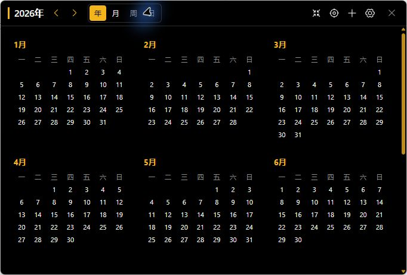 | 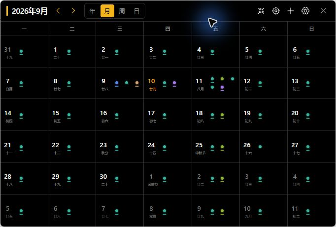 |

### 周、日时间轴：看清时间段与重叠关系

周视图适合比较一周的安排，日视图适合查看某一天的具体时间段。Event 按开始、结束时间绘制，Todo 则标在对应时间点；点击任意一项可以打开详情面板。

两个视图都支持切换时间轴排列方向。每个日期窗格按配置的轨道数均分，不会因为当天只有两个 Event 就让它们占满整个窗格。

| 周视图 · 对照一周安排 | 日视图 · 展开当天时间段 |
| --- | --- |
| 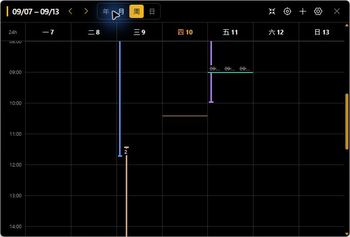 | 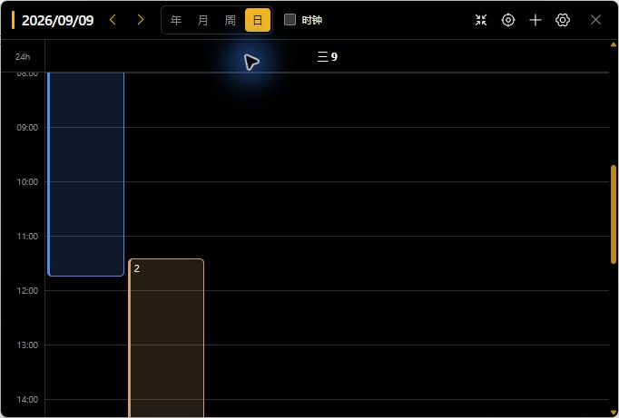 |

跨天 Event 会在涉及的每一天显示当天的部分：昨天开始、今天结束的日程，也能在今天的时间轴与时钟里看见。

### 24 小时时钟：把一天画在钟面上

在日视图勾选“时钟”，即可切换到 24 小时钟面：顶部是 0 点，右侧是 6 点，底部是 12 点，左侧是 18 点。刻度与数字位于外侧，内部空间留给 Event 圆弧。

- **外圈看 Todo，内圈看 Event**：颜色与日程设置保持一致；相同或相近时间的 Todo 会使用外圈轨道分开显示。
- **动态时针**：今天可显示动态时、分、秒针，并提供完整／精简时针模式；查看其他日期时，不显示当前时针与数字时间。
- **直接操作**：点击标记或圆弧查看详情；拖动 Todo 标记调整时间，拖动 Event 头尾调整开始或结束时间，步长为 5 分钟。
- **跨天处理**：圆弧只表示当前日期内的时间段，跨日裁切边界不作为可拖动端点。

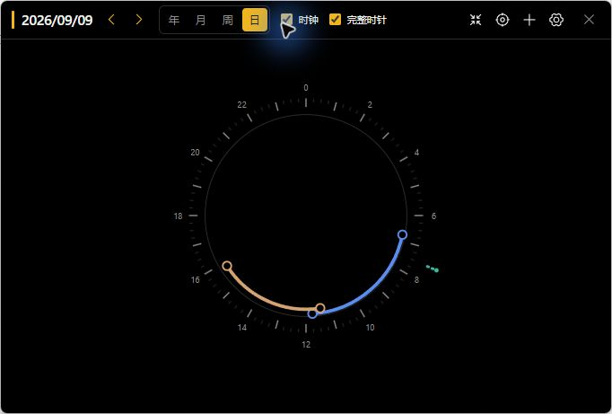

> 周期事项的拖动会修改**整个周期的时间**，不是仅调整当天这一次。单次改期尚未实现。

<details>
<summary>重叠日程如何分配轨道？</summary>

Event 依次放入轨道，时间轴从左向右、时钟从外向内检查，优先复用与已有 Event 不重叠的轨道。当所有轨道都发生冲突且达到上限时，从第一条轨道开启新一轮；旧轮仍然显示，但不再参与新一轮的冲突检查。因此轨道数是显示上限，并不保证任意密度的日程都完全不重叠。Todo 外圈轨道达到上限后也会循环使用。

</details>

### 小窗模式：桌面角落也能查看和操作

点击工具栏的小窗按钮，只保留**今天的时钟与恢复按钮**。窗口紧贴最外层 Todo 轨道，减少空白背景；点击右上角恢复完整日历，左上角空白处可以拖动窗口。

小窗不是静态挂件：Todo 和 Event 仍可点击打开详情，也可拖动调整时间。

<p align="center">
  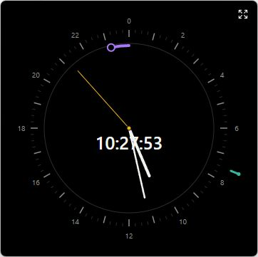
</p>

后台唤醒默认进入小窗模式。若习惯继续上次的工作，可以在设置中改为“上一次关闭时的样式”，也可以指定其他视图。

### 重复安排与联动日期选择

Todo 与 Event 都支持以下规则，无需每天手动创建：

| 规则 | 使用场景 |
| --- | --- |
| 仅一次 | 临时事项、单次会议 |
| 每天／工作日／周末 | 日常习惯、工作安排、周末计划 |
| 每周／每月 | 固定周会、月度事项 |
| 自定义日期 | 不规则但已经确定的多个日期 |

周期 Todo 可以只完成当天这一项，也可以将整个周期全部完成。Event 则按重复规则展开为各天的时间段，不需要完成打卡。

<details>
<summary>查看新建表单与日期选择界面</summary>

<p align="center">
  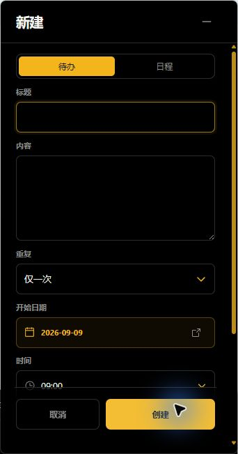
</p>

开始日期与 Event 结束日期复用主日历，顶部文字提示当前正在选择哪一项。选择后立即回填表单；减号仅收起日历，不关闭新建面板，也不会丢失已选日期。

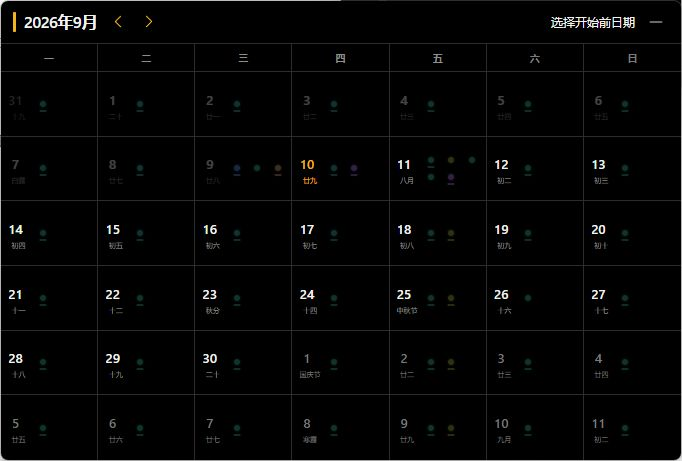

这里的“实时保存”是保留**表单中的选择状态**；只有点击“创建”才会写入新记录。

</details>

### 详情、编辑与提醒

点击周／日时间轴或时钟上的 Todo、Event，可在独立面板查看详情。Todo 的内容还能展开到更大的专注编辑窗口，保存后返回详情。

主日历之外最多保留一个辅助面板：新建、详情、设置、专注编辑与弹窗提醒会相互替换，避免桌面堆满窗口。用于选择日期的主日历不计入辅助面板。

Todo 提供两种提醒方式：

- **静默提醒**：使用 Windows 原生通知，不主动播放声音，可在通知横幅或通知中心查看。
- **弹窗提醒**：在屏幕右下角打开置顶的独立提醒窗口，主动聚焦并闪烁任务栏图标，不需要先展开主日历。

应用会安排**今天尚未到点、尚未完成且开启提醒**的 Todo。已经过点、当天已完成或全部完成的 Todo 不会提醒。隐藏到系统托盘后提醒仍会工作；从托盘完全退出应用后则不会提醒。

### 设置中心：按自己的习惯使用

设置采用独立大面板，侧边栏分为三个分类：

| 分类 | 可以调整什么 |
| --- | --- |
| 外观 | 背景颜色、主题颜色、窗口不透明度 |
| 首选项 | 默认视图、日视图首选模式、时针首选模式 |
| 配置项 | 周／日视图轨道排列方向、轨道数、后台唤醒样式 |

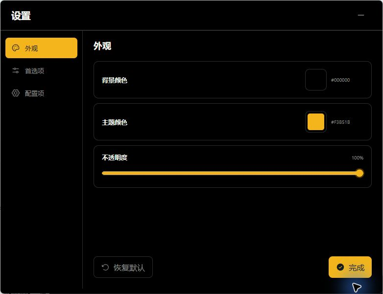

<details>
<summary>查看首选项与配置项</summary>

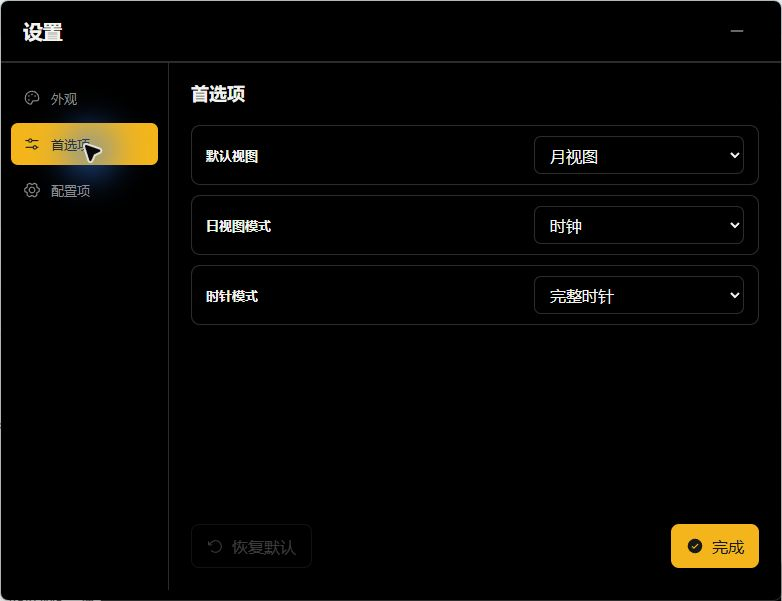

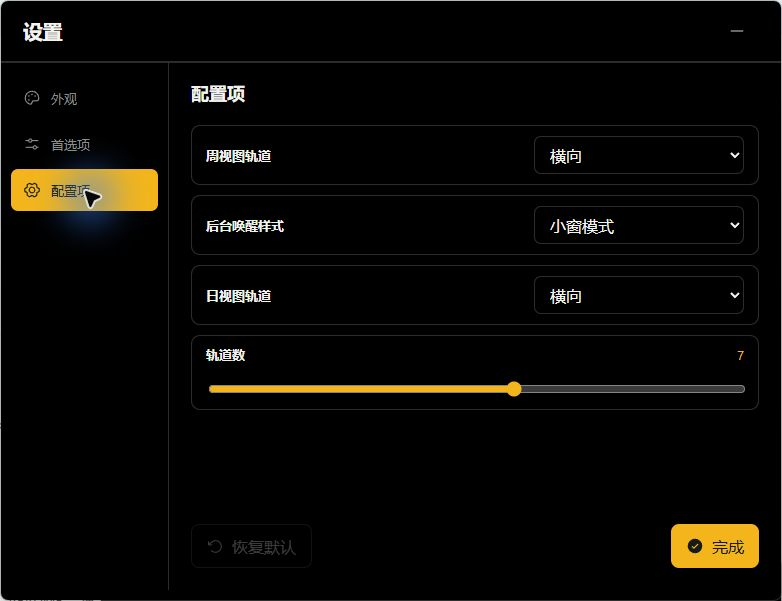

</details>

## 数据与隐私

Note 没有账户、云同步、广告或多人协作功能。日程只保存在本机 SQLite 数据库中：

```text
%APPDATA%\note-desktop\data\note.db
```

应用设置保存在同一目录上一级的 `appearance.json`，关闭到后台时的视图状态保存在 `workspace.json`。旧版本的设置文件会自动补齐新增选项。备份或迁移时，先从系统托盘中完全退出 Note，再复制整个 `%APPDATA%\note-desktop` 文件夹。

## 技术栈

- 后端：Go、Gin、GORM
- 数据库：SQLite（已启用 WAL、外键和写入等待）
- 周期计算：`rrule-go`
- 前端：React、Vite、Phosphor Icons
- 桌面端：Electron、electron-builder

## 项目结构

```text
note/
├─ cmd/api/                 Go 程序入口
├─ internal/
│  ├─ handler/              HTTP 参数解析与响应
│  ├─ model/                GORM 数据模型
│  ├─ router/               Gin 路由
│  ├─ todo/                 Todo 业务与数据访问
│  ├─ event/                Event 业务与数据访问
│  ├─ calendar/             组装 Todo 与 Event 日历实例
│  ├─ errors/               共享业务错误
│  ├─ utils/                通用工具
│  ├─ retry/                通用重试
│  └─ app.go                数据库、HTTP 服务与优雅关闭
├─ web/                     React 前端
└─ desktop/                 Electron 主进程、预加载脚本与打包配置
```

## 桌面版开发运行

开发环境需要：

- Go 1.26 或更高版本
- Node.js 和 npm
- Windows x64（当前 Electron 打包目标）

第一次运行先安装两部分依赖：

```powershell
cd web
npm install

cd ..\desktop
npm install
```

然后从 `desktop` 目录启动：

```powershell
npm run start
```

该命令会自动构建 React 前端、编译 Go 后端，并启动后端子进程与 Electron 窗口。开发版的数据库同样保存在 Electron 用户数据目录下。

## 浏览器开发模式

先从项目根目录启动 API：

```powershell
go run ./cmd/api
```

首次启动会自动创建 `data/note.db` 并迁移表结构。API 默认只监听本机：<http://127.0.0.1:8080/ping>。

再打开一个终端启动前端：

```powershell
cd web
npm run dev
```

访问终端显示的地址，默认是 <http://localhost:5173>。Vite 会把 `/api` 请求代理到 `127.0.0.1:8080`。

在 API 终端按 `Ctrl+C` 后，程序会先优雅关闭 HTTP 服务，再关闭 SQLite 连接池。

## 环境变量

| 变量 | 默认值 | 用途 |
| --- | --- | --- |
| `NOTE_DB_PATH` | `data/note.db` | SQLite 数据库文件位置 |
| `HTTP_ADDR` | `127.0.0.1:8080` | HTTP 监听地址；端口设为 `0` 时由系统分配 |
| `NOTE_WEB_DIR` | 空 | 可选的 React 构建产物目录，Electron 会自动设置 |
| `NOTE_STOP_ON_STDIN_CLOSE` | 空 | 设为 `1` 时，父进程关闭 stdin 后停止服务；由 Electron 使用 |

示例：

```powershell
$env:NOTE_DB_PATH = "D:\NoteData\note.db"
$env:HTTP_ADDR = "127.0.0.1:18080"
go run ./cmd/api
```

## API 概览

| 方法 | 路径 | 说明 |
| --- | --- | --- |
| `GET` | `/api/ping` | 健康检查 |
| `POST` | `/api/todos` | 创建 Todo |
| `GET` | `/api/todos` | 分页查询 Todo |
| `GET` | `/api/todos/:id` | 查询单个 Todo |
| `PATCH` | `/api/todos/:id` | 修改 Todo，使用 `version` 乐观锁 |
| `DELETE` | `/api/todos/:id` | 删除 Todo |
| `GET` | `/api/calendar?from=YYYY-MM-DD&to=YYYY-MM-DD` | 查询时间范围内的日程实例 |
| `PATCH` | `/api/todos/:id/occurrences/:date` | 修改某个 Todo 在某一天的完成状态 |
| `POST` | `/api/events` | 创建具有开始、结束时间的 Event |
| `GET` | `/api/events/:id` | 查询单个 Event |
| `PATCH` | `/api/events/:id` | 修改 Event，使用 `version` 乐观锁 |

## 数据表

- `todos`：日程标题、内容、规则、时间、颜色、提醒方式和版本。
- `todo_dates`：自定义重复模式选择的日期。
- `todo_completions`：只记录已经完成的单次日程日期；未记录即视为未完成。
- `events`：Event 的标题、内容、开始时间、结束时间、重复规则、颜色和版本。
- `event_dates`：Event 使用自定义重复模式时选择的日期。

周期日程的出现时间由查询范围即时计算，数据库不会为未来每一天预先插入记录。

## 构建 Windows 桌面程序

在 `desktop` 目录执行：

```powershell
# 生成可直接运行的目录
npm run pack

# 生成安装版和便携版
npm run dist
```

构建结果位于 `desktop/release/`。打包过程会自动重新构建 React 前端和 Go 后端。

## 检查

```powershell
# 项目根目录
go test ./...

cd web
npm run build

cd ..\desktop
npm test
node --check main.cjs
node --check preload.cjs
```
