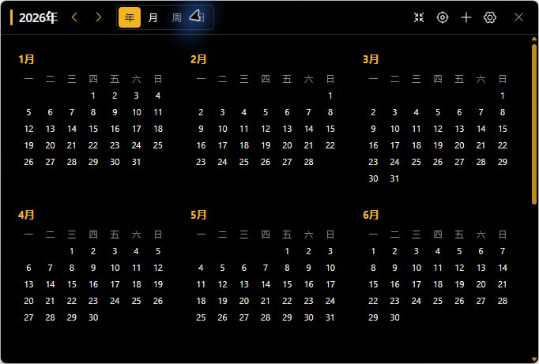
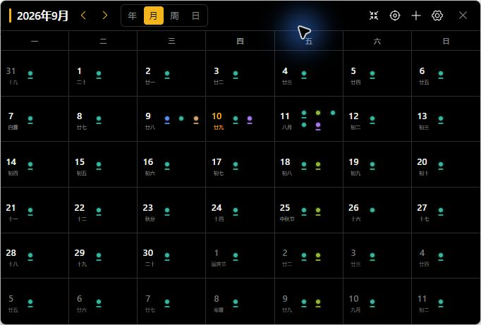
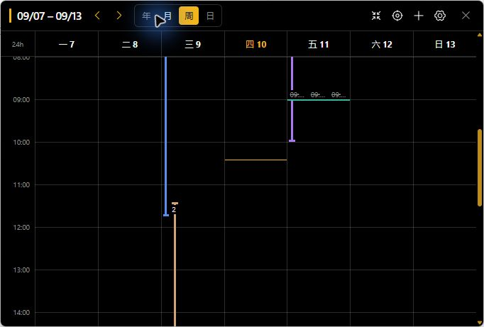
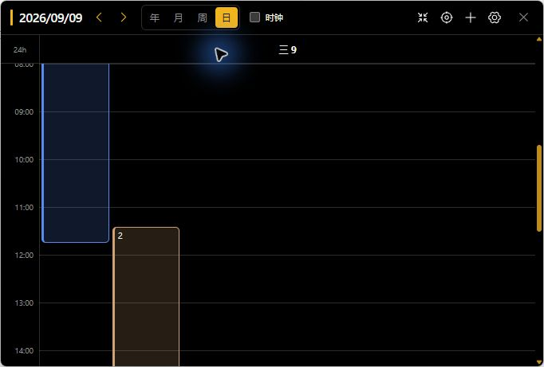
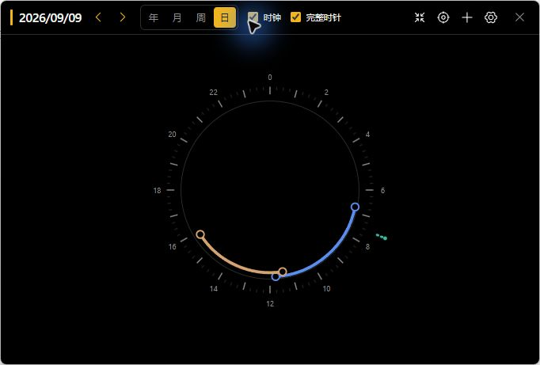
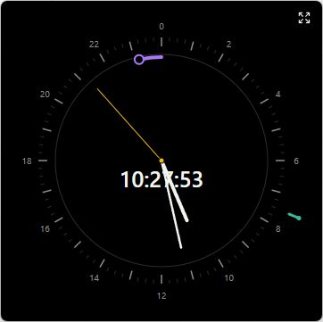

# Note

一个支持账号和群组协作的日历待办应用，提供 Windows / macOS 桌面端与浏览器开发模式。Todo（待办）记录需要完成的事项，Event（日程）安排有开始和结束时间的活动；日历可以按年、月、周、日查看，也可以用 24 小时时钟和桌面小窗展示。

<p align="center">
  
</p>

<p align="center">
  <a href="https://github.com/GH-ytym/note/releases/tag/v0.5.0">下载已发布的 v0.5.0</a>
</p>

## 当前状态

仓库正在从 v0.5.0 的单机日历发展为支持账号、群组和成员权限的协作版本。**下面的功能与开发说明以当前源码为准，Release 下载仍是 v0.5.0，不包含这些新增协作功能。**桌面包版本号暂时保留为 `0.5.0`。

| 模块 | 当前进度 |
| --- | --- |
| 账号 | 已有注册、登录、自动恢复登录、多窗口状态同步与退出登录 |
| 群组基础 | 已有创建、切换、成员列表、退出、转让群主后退出和解散 |
| 群内 Todo / Event | 已有创建、查看、编辑、删除、成员权限管理和按群组查看日历 |
| Todo 完成记录 | 已按用户记录每次完成状态，可查看当天完成成员 |
| 个人头像 | 已接入腾讯云 COS；配置存储后可上传、替换或移除头像 |
| 邀请入群与同意加群 | **开发中，尚未完成，当前阻塞新 Release**；已有固定群号查找、加入及申请通知 |
| 通知 | 已有通知列表、未读数量和 SSE 实时刷新；已读、审批操作和完整断点恢复待实现 |
| 搜索 | 已按当前群组搜索 Todo / Event，并校验登录与当前群成员资格；跨群组搜索待实现 |

群组使用固定、全局唯一的六位数字／大写字母 `code` 作为公开群号。登录后可输入群号预览并加入：public 直接加入，approval 创建申请并通知群主，restricted 拒绝主动申请，personal 不可查找或加入。分享链接和二维码只携带群号，不再支持刷新。**指定用户邀请和同意／拒绝审批仍待完成。**

## 功能

### 账号与群组工作区

首次使用当前源码需要注册并登录。账号支持通过邮箱或完整的 `用户名#12345` 登录；重新加载时会尝试恢复登录，退出入口位于“设置 → 账号”。

主界面左侧选择群组，右侧显示该群组的日历。新建窗口固定使用打开时的群组，提交 Todo / Event 时携带 `group_id`。群组图标由群组 ID 决定颜色，并显示群名首字。

群成员可以查看群内 Todo 和 Event；每条记录有独立的 `viewer`（只读）或 `editor`（可编辑）权限。创建者默认可编辑，其他成员默认只读；创建者可以批量调整成员权限，删除也仅限仍在群内的创建者。群主身份不自动获得其他成员创建记录的编辑权限。

搜索框只搜索当前选中的群组，支持按 Todo / Event 分栏或合并评分、排序和分页。退群者创建的 Todo / Event 保留在原群，现有群成员仍可搜索这些记录。改造前的 search 包在本地保留于 `internal/_backup/search/`，供后续跨群组搜索开发参考；该目录已被 Git 忽略，不参与正常构建。

普通成员可以退出群组；群主退出前需要将群主转让给其他成员，也可以解散群组。解散会删除群内 Todo、Event、权限与完成记录。

### 待办与日程

| | Todo · 待办 | Event · 日程 |
| --- | --- | --- |
| 适合记录 | 交报告、买东西、到点做某件事 | 会议、课程、专注工作等时间段 |
| 时间 | 一个时间点 | 开始与结束时间，可跨天 |
| 完成状态 | 每位用户分别记录某一天是否完成 | 不使用完成状态 |
| 时钟展示 | 钟面外侧的针形标记 | 钟面内部的时间圆弧 |
| 提醒 | 静默提醒或弹窗提醒，也可关闭 | 暂无 Event 提醒 |

点击工具栏的 **＋**，选择新建待办或日程。Todo 标题必填，允许重名；内容留空时使用标题。颜色可以随机生成，也可以手动选择。

周期 Todo 的完成只影响**当前用户、当前日期这一次**，不改变其他成员的状态；详情中可以查看这一天已完成的成员。当前源码已移除旧版“整个周期全部完成”的 `all_done` 状态。

### 多种日历视图

- **年视图**：按月份浏览日期，点击月份进入月视图。
- **月视图**：用彩色圆点概览 Todo 和 Event，点击日期进入当天。
- **周视图**：用时间轴比较一周的安排，支持横向或纵向排列。
- **日视图**：支持标签、时间轴、时钟三种样式，默认使用标签。标签按未完成待办、日程、已完成待办分组，可直接切换自己的完成状态。

时间轴按配置的轨道数展示 Event，并标出 Todo 的时间点。跨天 Event 会在涉及的每一天显示当天的部分。

### 24 小时时钟与拖动改期

钟面顶部为 0 点，右侧为 6 点，底部为 12 点，左侧为 18 点。外圈显示 Todo 标记，内圈显示 Event 圆弧；今天可显示动态时、分、秒针，并提供完整／精简时针模式。

有编辑权限时，可以在时间轴或时钟中拖动 Todo 调整时间，拖动 Event 的起止端点调整时间，步长为 5 分钟。跨天 Event 的裁切边界不作为可拖动端点。

> 周期事项的拖动会修改整个周期的时间；仅调整某一天这一次的单次改期尚未实现。轨道达到数量上限后会循环使用，密集日程仍可能重叠。

### 桌面小窗与提醒

点击小窗按钮，只保留今天的安排与恢复按钮。小窗可在设置中选择标签、时间轴或时钟样式，默认使用标签；仍可查看详情，按权限完成待办或调整时间。

后台唤醒默认进入小窗，也可以选择上一次关闭时的样式或指定视图。桌面端主日历之外最多保留一个辅助窗口，新建、详情、设置、专注编辑和弹窗提醒会相互替换。

Todo 支持两种桌面提醒：

- **静默提醒**：使用系统原生通知，不主动播放声音。
- **弹窗提醒**：在屏幕右下角打开置顶提醒窗口。

登录后，应用为当前用户安排今天尚未到点、尚未完成且开启提醒的 Todo。隐藏到系统托盘后提醒仍会工作；退出登录或完全退出应用后停止提醒。日历与提醒的日期计算使用 `Asia/Shanghai`。

### 重复安排与设置

Todo 和 Event 都支持仅一次、每天、工作日、周末、每周、每月及自定义日期。开始日期、结束日期与自定义日期通过主日历联动选择；选择过程保留表单状态，点击创建后才写入记录。

设置分为四类：

| 分类 | 内容 |
| --- | --- |
| 账号 | 查看账号资料、更换或移除头像、退出登录 |
| 外观 | 背景颜色、主题颜色、窗口不透明度 |
| 首选项 | 默认视图、日视图与小窗样式、时针模式、搜索分栏 |
| 配置项 | 时间轴方向、轨道数、搜索数量、后台唤醒样式 |

当前默认背景为白色 `#FFFFFF`，主题色为黄色；旧默认配色会迁移，自定义配色保留。

### 个人头像

点击侧边栏底部账号，进入个人资料更换或移除头像。未设置头像时显示占位图，显示时使用圆形裁切。

头像存储在腾讯云 COS，数据库只保存公开 URL，不在本机保存图片文件。支持 JPEG / PNG，文件不超过 5 MiB、宽高各不超过 4096 像素；后端验证图片内容，居中裁剪后转换为 512×512 JPEG，移除原始元数据。

COS 配置全部留空时，服务可以正常启动，头像上传入口禁用；只填写部分必需配置会导致启动报错。真实 COS 上传与公开访问需配置后验证。

## 已发布版本与截图

v0.5.0 是此前的单机桌面版，提供 Windows x64、macOS Apple Silicon（arm64）和 Intel（x64）下载：

| 版本 | 适合场景 | 下载 |
| --- | --- | --- |
| Windows 安装版 | 安装并创建桌面与开始菜单快捷方式 | [Note-Setup-0.5.0.exe](https://github.com/GH-ytym/note/releases/download/v0.5.0/Note-Setup-0.5.0.exe) |
| Windows 便携版 | 下载后直接运行 | [Note-0.5.0.exe](https://github.com/GH-ytym/note/releases/download/v0.5.0/Note-0.5.0.exe) |
| macOS Apple Silicon | M 系列芯片的 Mac | [Note-0.5.0-mac-arm64.dmg](https://github.com/GH-ytym/note/releases/download/v0.5.0/Note-0.5.0-mac-arm64.dmg) |
| macOS Intel | Intel 芯片的 Mac | [Note-0.5.0-mac-x64.dmg](https://github.com/GH-ytym/note/releases/download/v0.5.0/Note-0.5.0-mac-x64.dmg) |

v0.5.0 安装包已包含前端、Go 后端和 SQLite 支持，使用者无需安装开发环境。当前源码新增的 Redis 依赖不适用于这个旧 Release。

Windows 安装包没有代码签名，SmartScreen 可能显示“Windows 已保护你的电脑”；确认文件来自本仓库后，可选择“更多信息 → 仍要运行”。macOS 打开 DMG 后将 Note 拖入 Applications；若首次打开被阻止，确认来源后在“系统设置 → 隐私与安全性”中选择“仍要打开”。Mac 版没有 Apple Developer 签名或公证，另有 ZIP 包，通知需要在系统设置中允许。

<details>
<summary>查看 v0.5.0 截图（历史界面）</summary>

以下是 v0.5.0 Windows 桌面版的黑色背景与黄色主题截图，用于展示日历、时间轴和时钟。当前源码已调整布局、默认配色与完成状态，并增加账号和群组界面，截图不代表当前开发版外观。

| 年视图 | 月视图 |
| --- | --- |
|  |  |

| 周时间轴 | 日时间轴 |
| --- | --- |
|  |  |



<p align="center">
  
</p>

</details>

## 数据与存储

当前源码将账号、群组、Todo、Event、成员权限、完成记录、入群申请、通知和 outbox 存储在 **API 所在机器的 SQLite 数据库**中；Redis 保存刷新会话、通知推送历史和投递去重记录，并广播实时事件，COS 保存头像。这些协作功能依赖同一个后端，各台电脑独立运行的本地数据库不会自动同步。

| 运行方式 | SQLite 默认位置 |
| --- | --- |
| 命令行 API | 项目根目录启动时为 `data/note.db`，可通过 `NOTE_DB_PATH` 指定 |
| Windows 桌面端 | `%APPDATA%\note-desktop\data\note.db` |
| macOS 桌面端 | `~/Library/Application Support/note-desktop/data/note.db` |

桌面端设置保存在用户数据目录的 `appearance.json`，关闭到后台时的视图状态保存在 `workspace.json`；未设置 `NOTE_JWT_SECRET` 时，Electron 在 `data/jwt-secret` 生成并沿用签名密钥。备份桌面 SQLite 与设置前，请从托盘完全退出应用，再复制整个用户数据目录；Redis 会话和 COS 头像需分别处理。

**旧数据迁移尚有限制**：有数据的旧单机 Todo / Event 表需要先明确并回填 `group_id` 与 `creator_id`，旧完成记录也需要明确用户归属；当前迁移不会自动猜测这些归属。开发时建议使用独立数据库，保留 v0.5.0 数据备份。

主要数据表：

| 表 | 内容 |
| --- | --- |
| `users` | 用户名、账号后缀、邮箱、密码哈希、昵称与头像 URL |
| `groups` / `group_members` | 群组、群主、固定群号和成员资格 |
| `todos` / `events` | 待办与日程、所属群组、创建者、时间、重复规则和版本 |
| `todo_dates` / `event_dates` | 自定义重复日期 |
| `todo_members` / `event_members` | 每条记录的成员编辑权限 |
| `todo_completions` | 按 Todo 和日期保存完成用户及完成时间 |
| `group_join_requests` / `notifications` / `outboxes` | 入群申请、持久化通知与后台投递任务 |

周期日程按查询范围即时展开，不会为未来每一天预先插入记录。

详细字段与关联见 [数据库表结构](docs/database-schema.md)。

## 技术栈与项目结构

- 后端：Go、Gin、GORM、SQLite、Redis、JWT / bcrypt
- 周期计算：`rrule-go`
- 前端：React、TypeScript、Vite、Phosphor Icons、`qrcode.react`
- 桌面端：Electron、TypeScript、electron-builder
- 头像存储：腾讯云 COS

```text
note/
├─ cmd/api/                 Go 程序入口
├─ internal/
│  ├─ auth/                 注册、登录、JWT 与刷新会话
│  ├─ middleware/           登录验证与认证请求检查
│  ├─ group/                群组、群号与成员管理
│  ├─ profile/              用户资料、图片处理与 COS 存储
│  ├─ todo/                 Todo、成员权限与个人完成记录
│  ├─ event/                Event 与成员权限
│  ├─ calendar/             聚合 Todo / Event 日历实例
│  ├─ search/               标题与内容搜索
│  ├─ handler/              HTTP 参数解析与响应
│  ├─ model/                GORM 数据模型
│  ├─ router/               Gin 路由
│  ├─ errors/               共享业务错误
│  ├─ retry/                通用重试
│  ├─ utils/                日期、颜色与群号生成工具
│  └─ app.go                数据库、服务组装与优雅关闭
├─ web/                     React 前端与界面样式
├─ desktop/                 Electron 主进程、preload、测试与打包配置
├─ docs/                    截图、认证说明与验证记录
└─ scripts/                 本地认证调试脚本
```

## 开发运行

以下说明适用于当前源码。需要 Go 1.26.0 或更高版本、Node.js 与 npm（CI 使用 Node.js 24），以及独立运行的 Redis。**当前桌面包不内置 Redis，后端启动时会检查连接。**

在项目根目录安装依赖：

```powershell
npm install --prefix web
npm install --prefix desktop
```

### 桌面模式

先启动 Redis；默认连接 `127.0.0.1:6379`，其他地址或密码通过环境变量配置。然后在项目根目录执行：

```powershell
npm run start --prefix desktop
```

该命令会编译桌面 TypeScript、构建 React 前端与 Go 后端，再启动后端子进程和 Electron。Electron 自动生成 JWT 密钥，并使用系统分配的本机端口；默认数据库位于上文所列用户数据目录。

如果该目录已有 v0.5.0 数据，需先处理数据归属迁移。桌面端会自行设置数据库路径，`NOTE_DB_PATH` 的自定义值仅适用于独立启动 API。

### 浏览器模式

启动 Redis 后，在项目根目录配置 JWT 密钥并启动 API：

```powershell
# 为本地开发生成随机密钥；持续使用同一后端时应保存并复用该值
$env:NOTE_JWT_SECRET = node -e "process.stdout.write(require('node:crypto').randomBytes(48).toString('base64url'))"
$env:NOTE_REDIS_ADDR = "127.0.0.1:6379"
$env:NOTE_DB_PATH = "data/note-dev.db"
go run ./cmd/api
```

API 默认监听 `127.0.0.1:8080`，首次启动会创建指定数据库并迁移表结构；健康检查为 [http://127.0.0.1:8080/api/ping](http://127.0.0.1:8080/api/ping)。

另开终端，在项目根目录启动前端：

```powershell
npm run dev --prefix web
```

访问终端显示的地址，默认是 [http://localhost:5173](http://localhost:5173)。Vite 将 `/api` 请求代理至本机 8080 端口；若修改 API 端口，需要同步调整 `web/vite.config.ts` 的代理地址。在 API 终端按 `Ctrl+C` 会依次关闭 HTTP 服务与 SQLite 连接池。

### 环境变量

| 变量 | 默认值 | 用途 |
| --- | --- | --- |
| `NOTE_DB_PATH` | `data/note.db` | 独立 API 的 SQLite 文件位置；Electron 自行设置 |
| `HTTP_ADDR` | `127.0.0.1:8080` | HTTP 监听地址；Electron 使用 `127.0.0.1:0` 自动分配端口 |
| `NOTE_JWT_SECRET` | 无 | 至少 32 字节；独立 API 必填，Electron 未配置时自动生成 |
| `NOTE_REDIS_ADDR` | `127.0.0.1:6379` | Redis 地址 |
| `NOTE_REDIS_PASSWORD` | 空 | Redis 密码 |
| `NOTE_COOKIE_SECURE` | `false` | 设为 `true` 时刷新 Cookie 仅通过 HTTPS 发送 |
| `NOTE_WEB_DIR` | 空 | 可选的 React 构建目录，Electron 自动设置 |
| `NOTE_STOP_ON_STDIN_CLOSE` | 空 | 设为 `1` 时父进程关闭 stdin 后停止服务，Electron 自动设置 |
| `NOTE_COS_BUCKET_URL` | 空 | COS 桶的 HTTPS 地址 |
| `NOTE_COS_SECRET_ID` | 空 | COS 访问密钥 ID |
| `NOTE_COS_SECRET_KEY` | 空 | COS 访问密钥 |
| `NOTE_COS_PUBLIC_URL` | 桶地址 | 可选的头像 HTTPS 自定义域名或 CDN 地址 |

头像配置示例桶地址：`https://bucket-appid.cos.ap-shanghai.myqcloud.com`。头像 URL 需要可公开读取，上传与删除由后端凭证执行；密钥只放后端环境变量，不应写入前端或提交到 Git。

## API 概览

统一使用 `/api` 前缀，路由同时保留无前缀的别名。除健康检查和认证接口外，业务接口均要求 `Authorization: Bearer <access_token>`。

登录、刷新和退出额外要求 `X-Note-Request: 1`；刷新和退出使用 `note_refresh` Cookie。Access JWT 有效期为 60 分钟，刷新会话轮换后的有效期为 7 天；前端遇到 401 会尝试刷新并重试一次。详细说明见 [登录、自动恢复与退出](docs/authentication.md)，本地调试见 [认证调试指南](docs/debug-auth.md)。

| 方法 | 路径 | 说明 |
| --- | --- | --- |
| `GET` | `/api/ping` | 健康检查 |
| `POST` | `/api/auth/register` | 注册，提交 `{name, email, password}` |
| `POST` | `/api/auth/login` | 登录，提交 `{account, password}` |
| `POST` | `/api/auth/refresh` | 使用 Cookie 换取新 JWT |
| `POST` | `/api/auth/logout` | 撤销当前刷新会话并清除 Cookie |
| `GET / POST` | `/api/groups` | 查询自己的群组／创建群组 |
| `GET` | `/api/groups/:groupID/members` | 查询群成员 |
| `GET` | `/api/groups/lookup?code=ABC123` | 按固定群号预览群名和加入规则，要求登录 |
| `POST` | `/api/groups/join` | 接收 `{code}`，按最新 policy 加入或创建申请 |
| `GET` | `/api/notifications` | 当前用户最近 50 条通知与全部未读数量 |
| `GET` | `/api/notifications/stream` | 携带 access token 建立 SSE，JWT 到期后重新连接 |
| `POST` | `/api/groups/:groupID/quit` | 退出；群主需提交 `{target}` 转让 |
| `POST` | `/api/groups/:groupID/dismiss` | 解散群组，限群主 |
| `GET` | `/api/groups/:groupID/todos`、`/api/groups/:groupID/events` | 分页查询群内 Todo / Event |
| `POST` | `/api/todos`、`/api/events` | 创建记录，需携带 `group_id` |
| `GET / PATCH / DELETE` | `/api/todos/:id`、`/api/events/:id` | 查询、编辑、删除；编辑使用 `version` 乐观锁 |
| `PATCH` | `/api/todos/:id/members`、`/api/events/:id/members` | 创建者批量修改成员权限 |
| `PATCH` | `/api/todos/:id/occurrences/:date` | 修改自己的某次完成状态，提交 `{done}` |
| `GET` | `/api/todos/:id/occurrences/:date/completions` | 查询当天完成成员 |
| `GET` | `/api/calendar?from=YYYY-MM-DD&to=YYYY-MM-DD&group_id=ID` | 查询日历实例；`group_id` 可选，日期范围为左闭右开 |
| `GET` | `/api/groups/:groupID/search/todos`、`/api/groups/:groupID/search/events`、`/api/groups/:groupID/search/all` | 仅搜索指定群组；校验当前成员资格，支持评分与分页 |
| `GET` | `/api/users/me` | 本人公开资料与 `avatar_upload_enabled` |
| `PUT / DELETE` | `/api/users/me/avatar` | 上传／移除头像；上传使用 multipart 文件字段 `avatar` |

成员权限请求为 `{user_ids, role}`，其中 `role=1` 表示 editor，`role=2` 表示 viewer。

## 检查与构建

在项目根目录执行：

```powershell
go test ./...
npm test --prefix web
npm run build --prefix web
npm test --prefix desktop
npm run typecheck --prefix desktop
```

认证测试使用 miniredis，不需要连接开发 Redis。桌面测试会先编译 `desktop/*.cts` 与 `desktop/scripts/*.cts` 到 `desktop/dist/`；Electron 从 `dist/main.cjs` 启动，preload 编译为独立 CommonJS 文件，前端与 preload 共用的接口声明位于 `desktop/contracts.cts`。

本地打包：

```powershell
# Windows：生成可直接运行的目录
npm run pack --prefix desktop

# Windows：生成安装版和便携版
npm run dist --prefix desktop

# macOS：在 Mac 上生成当前机器架构的 DMG 和 ZIP
npm run dist:mac --prefix desktop
```

构建结果位于 `desktop/release/`；这些命令会重新构建桌面代码、前端与 Go 后端。macOS 构建时 Go 后端与 Electron 使用相同架构。

当前打包版本号及现有 macOS 发布工作流仍固定为 `0.5.0`。新版本发布需等邀请入群与同意加群流程完成后再更新。
