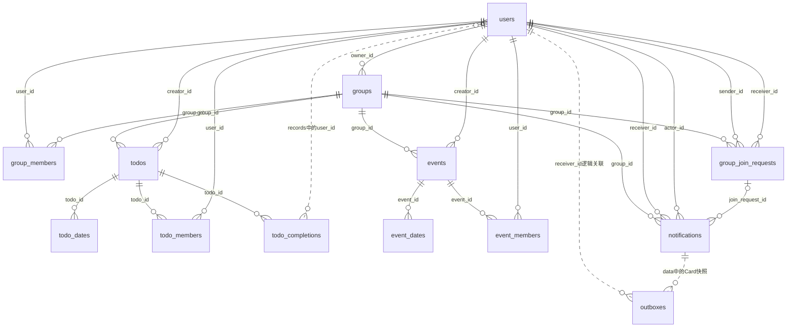
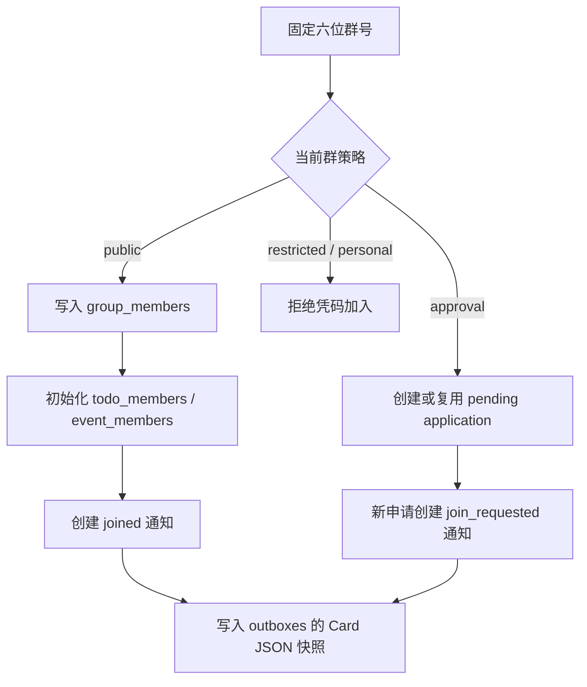

# 数据库表结构与关联

源码核对日期：2026-10-08。依据当前源码及启动迁移；第 6 节保留 2026-10-07 对 `data/note.db` 的只读检查快照，不能用作当前运行库的状态。本文区分“源码迁移后的结构”和“历史本地数据库快照”。

## 1. 存储边界与表清单

业务数据使用 **SQLite + GORM**，启动迁移入口为 [internal/migration.go](../internal/migration.go)。当前源码包含 **13 张业务表**，不计 SQLite 自身的 `sqlite_sequence`。

| 领域 | 表 | 一行代表什么 | 主键 |
| --- | --- | --- | --- |
| 账号 | `users` | 一个用户 | `id` |
| 群组 | `groups` | 一个群组／空间 | `id` |
| 群组 | `group_members` | 一个用户加入一个群组 | `(group_id, user_id)` |
| 入群流程 | `group_join_requests` | 一次邀请或申请 | `id` |
| 通知 | `notifications` | 发给一个用户的一条持久化通知 | `id` |
| 消息投递 | `outboxes` | 一次待发布的事件及其 JSON 快照 | `id` |
| 待办 | `todos` | 一条待办及其重复规则 | `id` |
| 待办 | `todo_dates` | 一条待办的一个自定义日期 | `id` |
| 待办权限 | `todo_members` | 一个用户对一条待办的权限 | `(todo_id, user_id)` |
| 待办完成 | `todo_completions` | 一条待办在某一天的全部完成用户 | `id` |
| 日程 | `events` | 一条日程及其重复规则 | `id` |
| 日程 | `event_dates` | 一条日程的一个自定义日期 | `id` |
| 日程权限 | `event_members` | 一个用户对一条日程的权限 | `(event_id, user_id)` |

SQLite 以外的存储：

- Redis：刷新会话，键为 `note:refresh:<令牌 SHA-256>`，值为用户 ID，有效期为 7 天；另有通知历史、投递去重记录和实时广播频道，见第 3.13 节。没有 SQLite `sessions` 表。
- 腾讯云 COS：头像图片；`users.avatar` 只保存公开 URL。
- Electron 用户目录中的 `appearance.json` / `workspace.json`：界面设置与工作区状态；没有对应数据库表。
- 日历实例、搜索结果、桌面提醒、通知 Card 都由代码计算或组装，不是额外的表。`CompletionEntry` 是 JSON 元素；`NotifyMode` 是枚举。

来源：[数据库与服务组装](../internal/app.go)、[刷新会话](../internal/auth/refresh.go)、[日历聚合](../internal/calendar/service.go)、[通知 DTO](../internal/notification/dto.go)。

## 2. 核心关联图

实线表示数据库外键；虚线表示仅由字段或 JSON 保存的业务关联。图中省略部分用户角色外键，完整清单见第 4 节。



用户与群组通过 `group_members` 形成多对多关系；用户与 Todo / Event 通过各自的权限表形成多对多关系。`groups.owner_id` 与 `todos/events.creator_id` 则分别记录群主、创建者，不能用权限关系代替。

## 3. 字段结构

类型按 SQLite 存储类型描述：ID / 版本为 `integer`，字符串与枚举为 `text`，时间为 `datetime`，纯日期为 `date`。GORM 的 `size` 标签不会在 SQLite 自动变成字符串长度 CHECK；长度规则还要看 Service 校验。

`id` 为单列主键的表使用自增整数；关系对象如 `Owner`、`Creator`、`Members`、`CustomDates` 是 GORM 关联字段，不会作为同名列保存到主表。以下结构以当前源码新建库为基准，旧库的实际 DDL 可能不同。

### 3.1 `users`：用户

| 字段 | 类型 | 约束／作用 |
| --- | --- | --- |
| `id` | integer | 主键 |
| `username` | text | NOT NULL；账号名，模型 size 80，可重名 |
| `suffix` | integer | NOT NULL；CHECK：10000–99999；与 `username` 联合唯一 |
| `email` | text | NOT NULL；唯一；模型 size 254 |
| `password_hash` | text | NOT NULL；密码哈希 |
| `nickname` | text | NOT NULL；显示昵称，模型 size 80 |
| `avatar` | text | NOT NULL；默认空字符串；头像公开 URL |
| `created_at` / `updated_at` | datetime | 创建／更新时间 |

唯一索引：`idx_users_account(username, suffix)`、`idx_users_email(email)`。完整账号格式为 `username#12345`，`username` 本身不唯一。

来源：[user.go](../internal/model/user.go)、[认证迁移](../internal/auth_migration.go)。

### 3.2 `groups`：群组与空间

| 字段 | 类型 | 约束／作用 |
| --- | --- | --- |
| `id` | integer | 主键 |
| `name` | text | NOT NULL；模型 size 80；允许重名 |
| `policy` | text | NOT NULL；默认 `public`；CHECK 限定四种策略 |
| `owner_id` | integer | NOT NULL；外键 → `users.id`；普通索引 |
| `code` | text | NOT NULL；模型 size 6；全局唯一的固定公开群号；唯一索引 `idx_groups_code` |
| `created_at` / `updated_at` | datetime | 创建／更新时间 |

策略枚举：

| 值 | 模型定义的含义 | 当前群号查找／加入逻辑 |
| --- | --- | --- |
| `restricted` | 仅群主邀请，禁止凭码申请 | 拒绝 |
| `public` | 允许直接凭码入群 | 写入成员、权限、通知和 outbox |
| `approval` | 凭码申请后由群主审核 | 写入申请、通知和 outbox，暂不加入成员 |
| `personal` | 单人空间 | 查找和加入均返回不存在 |

群名允许重名；群号固定且全局唯一，不再支持刷新，也不是入群凭证。登录用户可只凭群号预览群名和加入规则，再按最新 policy 加入或申请。创建接口当前固定创建 `public` 群，遇到群号冲突会重新生成，最多尝试五次。启动迁移保留有效且唯一的旧码；重复码保留最早的群组，其余重复码、空码和格式不合法的码重新分配，再建立唯一索引。群主身份只保存在 `owner_id`。模型注释描述了其他策略的邀请／个人空间规则，但不代表这些流程均已实现。

来源：[group.go](../internal/model/group.go)、[群组创建服务](../internal/group/service.go)、[群组仓库](../internal/group/repository.go)。

### 3.3 `group_members`：群成员资格

| 字段 | 类型 | 约束／作用 |
| --- | --- | --- |
| `group_id` | integer | 联合主键；外键 → `groups.id` |
| `user_id` | integer | 联合主键；外键 → `users.id`；普通索引 |
| `joined_at` | datetime | GORM 自动记录加入时间 |

主键 `(group_id, user_id)` 防止重复加入；`idx_group_members_user_id(user_id)` 支持查用户加入的群。该表没有 `role` 列；是否为群主看 `groups.owner_id`。

来源：[group_member.go](../internal/model/group_member.go)、[群组迁移](../internal/group_migration.go)。

### 3.4 `todos`：待办定义

| 字段 | 类型 | 约束／作用 |
| --- | --- | --- |
| `id` | integer | 主键 |
| `title` | text | NOT NULL；默认空字符串；模型 size 50；Service 要求非空；不唯一 |
| `content` | text | NOT NULL；模型 size 500；Go 字段虽为指针，数据库仍不允许 NULL |
| `color` | text | NOT NULL；默认 `#F3B51B`；模型 size 7 |
| `starts_at` | datetime | NOT NULL；待办时间点及重复起点 |
| `repeat_mode` | text | NOT NULL；默认 `once`；模型 size 20 |
| `notify_mode` | text | NOT NULL；默认 `none`；模型 size 20 |
| `version` | integer | NOT NULL；默认 1；内容更新使用乐观锁 |
| `group_id` | integer | NOT NULL；外键 → `groups.id`；普通索引 |
| `creator_id` | integer | NOT NULL；外键 → `users.id`；普通索引 |
| `created_at` / `updated_at` | datetime | 创建／更新时间 |

`repeat_mode`：`once`、`daily`、`weekdays`、`weekends`、`weekly`、`monthly`、`custom`。

`notify_mode`：`none`、`silent`、`popup`。这两个枚举目前由业务代码校验，没有模型级数据库枚举 CHECK。

Todo 没有 `ends_at`、`done` 或当前版本的 `all_done` 列；完成状态从 `todo_completions.records` 按用户和日期计算。也没有单独的重复截止日期字段。

来源：[todo.go](../internal/model/todo.go)、[reminder.go](../internal/model/reminder.go)、[Todo 仓库](../internal/todo/repository.go)。

### 3.5 `todo_dates`：待办自定义日期

| 字段 | 类型 | 约束／作用 |
| --- | --- | --- |
| `id` | integer | 主键 |
| `todo_id` | integer | NOT NULL；外键 → `todos.id` |
| `date` | date | NOT NULL；自定义发生日期 |
| `created_at` | datetime | 创建时间 |

唯一索引：`idx_todo_date(todo_id, date)`。仅用于 `repeat_mode = custom`；日期行不保存独立的标题、时间或版本。

来源：[todo_date.go](../internal/model/todo_date.go)。

### 3.6 `todo_members`：待办权限

| 字段 | 类型 | 约束／作用 |
| --- | --- | --- |
| `todo_id` | integer | 联合主键；外键 → `todos.id` |
| `user_id` | integer | 联合主键；外键 → `users.id`；普通索引 |
| `role` | text | NOT NULL；CHECK：`viewer` / `editor`；模型 size 16 |
| `created_at` / `updated_at` | datetime | 创建／更新时间 |

主键 `(todo_id, user_id)`，普通索引 `idx_todo_members_user_id(user_id)`。该表记录编辑权限，访问前仍须检查当前群成员资格。

来源：[todo_member.go](../internal/model/todo_member.go)。

### 3.7 `todo_completions`：某天的完成用户集合

| 字段 | 类型 | 约束／作用 |
| --- | --- | --- |
| `id` | integer | 主键 |
| `todo_id` | integer | NOT NULL；外键 → `todos.id` |
| `occurs_on` | date | NOT NULL；这次待办发生的日期 |
| `records` | text | 启动迁移建表为 NOT NULL、默认 `'[]'`；GORM 使用 JSON serializer |

唯一索引：`idx_todo_completion(todo_id, occurs_on)`。注意：**一行对应一个 Todo 的一天，并非一个用户的一次完成。**

例如 `todo_id = 42`、`occurs_on = 2026-10-07` 的 `records`：

```json
[
  { "user_id": 7, "completed_at": "2026-10-07T01:20:00Z" },
  { "user_id": 9, "completed_at": "2026-10-07T01:35:00Z" }
]
```

用户 7 取消完成时，只移除用户 7 的 JSON 元素；取消后数组为空时保留这一行。JSON 中的 `user_id` 没有数据库外键，也没有数据库级用户去重约束，由仓库代码检查和维护。

来源：[todo_completion.go](../internal/model/todo_completion.go)、[完成表迁移](../internal/todo_completion_migration.go)、[SetOccurrenceDone](../internal/todo/repository.go)。

### 3.8 `events`：日程定义

| 字段 | 类型 | 约束／作用 |
| --- | --- | --- |
| `id` | integer | 主键 |
| `title` | text | NOT NULL；模型 size 50 |
| `content` | text | 可为 NULL；模型 size 500 |
| `color` | text | NOT NULL；默认 `#F3B51B`；模型 size 7 |
| `starts_at` | datetime | NOT NULL；普通索引；开始时间 |
| `ends_at` | datetime | NOT NULL；普通索引；CHECK：`ends_at > starts_at` |
| `repeat_mode` | text | NOT NULL；默认 `once`；同 Todo 的重复枚举 |
| `version` | integer | NOT NULL；默认 1；内容更新使用乐观锁 |
| `group_id` | integer | NOT NULL；外键 → `groups.id`；普通索引 |
| `creator_id` | integer | NOT NULL；外键 → `users.id`；普通索引 |
| `created_at` / `updated_at` | datetime | 创建／更新时间 |

Event 表示时间段，`ends_at` 是这一段活动的结束时间，不是周期重复的截止日期。Event 没有完成状态表或 `notify_mode`。

普通索引：`idx_events_starts_at`、`idx_events_ends_at`、`idx_events_group_id`、`idx_events_creator_id`。

来源：[event.go](../internal/model/event.go)。

### 3.9 `event_dates`：日程自定义日期

| 字段 | 类型 | 约束／作用 |
| --- | --- | --- |
| `id` | integer | 主键 |
| `event_id` | integer | NOT NULL；外键 → `events.id` |
| `date` | date | NOT NULL；自定义发生日期 |
| `created_at` | datetime | 创建时间 |

唯一索引：`idx_event_date(event_id, date)`。结构与 `todo_dates` 对称。

来源：[event_date.go](../internal/model/event_date.go)。

### 3.10 `event_members`：日程权限

| 字段 | 类型 | 约束／作用 |
| --- | --- | --- |
| `event_id` | integer | 联合主键；外键 → `events.id` |
| `user_id` | integer | 联合主键；外键 → `users.id`；普通索引 |
| `role` | text | NOT NULL；CHECK：`viewer` / `editor`；模型 size 16 |
| `created_at` / `updated_at` | datetime | 创建／更新时间 |

主键 `(event_id, user_id)`，普通索引 `idx_event_members_user_id(user_id)`。该表只表示编辑权限，不表示报名、签到或完成状态。

来源：[event_member.go](../internal/model/event_member.go)。

### 3.11 `group_join_requests`：入群邀请／申请

| 字段 | 类型 | 约束／作用 |
| --- | --- | --- |
| `id` | integer | 主键 |
| `group_id` | integer | NOT NULL；外键 → `groups.id`；普通索引 |
| `kind` | text | NOT NULL；CHECK：`invitation` / `application` |
| `sender_id` | integer | NOT NULL；外键 → `users.id`；普通索引 |
| `receiver_id` | integer | NOT NULL；外键 → `users.id`；普通索引 |
| `status` | text | NOT NULL；默认 `pending`；CHECK 限定四种状态 |
| `handled_at` | datetime | 可为 NULL；处理时间 |
| `created_at` / `updated_at` | datetime | 创建／更新时间 |

状态：`pending`、`accepted`、`rejected`、`cancelled`。申请场景中发送者为申请人，接收者为创建申请时的群主。

没有 `expires_at` 列；当前 Join 逻辑根据 `created_at + 7 天` 判断已有待处理申请是否可复用。也没有数据库唯一索引限制“同群、同申请人只能有一条 pending”，重复申请复用由事务内查询实现。

当前代码已实现 `approval` 申请创建；结构同时支持邀请及接受／拒绝／取消状态，但现有路由未接入这些处理接口。

来源：[join.go](../internal/model/join.go)、[Join](../internal/group/repository.go)、[路由](../internal/router/router.go)。

### 3.12 `notifications`：持久化通知

| 字段 | 类型 | 约束／作用 |
| --- | --- | --- |
| `id` | integer | 主键 |
| `receiver_id` | integer | NOT NULL；外键 → `users.id`；通知接收者 |
| `actor_id` | integer | NOT NULL；外键 → `users.id`；通知触发者 |
| `group_id` | integer | NOT NULL；外键 → `groups.id`；普通索引 |
| `join_request_id` | integer | 可为 NULL；外键 → `group_join_requests.id`；普通索引 |
| `type` | text | NOT NULL；CHECK：`joined` / `join_requested` |
| `read_at` | datetime | 可为 NULL；NULL 表示未读 |
| `created_at` | datetime | 创建时间；没有 `updated_at` |

联合普通索引：`idx_notifications_receiver_read(receiver_id, read_at)`，用于按接收者统计未读通知。另有 `group_id`、`join_request_id` 索引。

`joined` 对应 public 直接入群，一般不关联申请；`join_requested` 对应申请，关联 `group_join_requests`。**申请处理状态看请求的 `status`；通知已读状态看 `read_at`，两者独立。** 当前已有列表、SSE 订阅接口，未接入标记已读接口。

来源：[notification.go](../internal/model/notification.go)、[通知仓库](../internal/notification/repository.go)、[路由](../internal/router/router.go)。

### 3.13 `outboxes`：事件投递任务

| 字段 | 类型 | 约束／作用 |
| --- | --- | --- |
| `id` | integer | 自增主键；投递任务 ID |
| `receiver_id` | integer | NOT NULL；逻辑上对应用户；**未声明外键** |
| `name` | text | NOT NULL；事件名，如 `notification.created` |
| `data` | text | NOT NULL；Card 的 JSON 快照 |
| `created_at` | datetime | NOT NULL；创建时间 |
| `published_at` | datetime | 可为 NULL；普通索引；记录成功交给 Redis 的时间 |

`Outbox` 使用 GORM 默认复数表名 `outboxes`。该表没有 `notification_id` / `group_id` 列，也没有指向 `users` 或 `notifications` 的数据库外键；通知 ID 等资料保存在 `data` 中。

Join 在同一 SQLite 事务中保存业务记录、通知和 outbox；`data` 是生成时的快照，后续改名或处理申请不会自动改写它。后台 worker 每轮读取最多 100 条未投递任务，成功交给 Redis 后更新 `published_at`；失败的任务留给后续轮次重试。`published_at` 即使有值也不等于“用户已收到”或“用户已读”。

每个接收者对应 Redis 键前缀 `note:notifications:{<用户 ID>}`：`:history` 是事件 Stream，`:sent` 是 Outbox ID 到 Stream ID 的去重映射，`:live` 是实时广播频道。同一个任务重试不会重复追加历史，但会再次广播相同事件 ID。后端订阅 Redis 广播，转交 Hub，再由 SSE 发给各窗口；这些历史和去重记录目前没有容量或过期限制。

已有 `HistoryAfter` 查询入口，一页最多 100 条；SSE handler 尚未调用它，也没有读取 `Last-Event-ID`。当前前端将 SSE 事件作为重查 SQLite 通知列表的信号，连接成功、窗口获得焦点及每分钟也会重查；完整断点恢复仍待接入。

来源：[outbox.go](../internal/model/outbox.go)、[enqueueNotice](../internal/group/repository.go)、[worker](../internal/notification/outbox_worker.go)、[发布器](../internal/notification/redis_publisher.go)、[历史查询](../internal/notification/redis_history.go)、[服务组装](../internal/app.go)、[前端通知接收](../web/src/hooks/useNotifications.ts)。

## 4. 外键与删除行为

下表的删除行为指 **删除被引用的父记录** 时发生什么。当前 API 的 SQLite DSN 启用 `foreign_keys(on)`。未显式设置 `OnDelete` 的用户权限外键使用 `NO ACTION`。

| 子表字段 | 引用 | 删除父记录时 |
| --- | --- | --- |
| `groups.owner_id` | `users.id` | RESTRICT |
| `group_members.group_id` | `groups.id` | CASCADE |
| `group_members.user_id` | `users.id` | RESTRICT |
| `todos.group_id` | `groups.id` | RESTRICT |
| `todos.creator_id` | `users.id` | RESTRICT |
| `todo_dates.todo_id` | `todos.id` | CASCADE |
| `todo_members.todo_id` | `todos.id` | CASCADE |
| `todo_members.user_id` | `users.id` | NO ACTION |
| `todo_completions.todo_id` | `todos.id` | CASCADE |
| `events.group_id` | `groups.id` | RESTRICT |
| `events.creator_id` | `users.id` | RESTRICT |
| `event_dates.event_id` | `events.id` | CASCADE |
| `event_members.event_id` | `events.id` | CASCADE |
| `event_members.user_id` | `users.id` | NO ACTION |
| `group_join_requests.group_id` | `groups.id` | CASCADE |
| `group_join_requests.sender_id` | `users.id` | RESTRICT |
| `group_join_requests.receiver_id` | `users.id` | RESTRICT |
| `notifications.receiver_id` | `users.id` | CASCADE |
| `notifications.actor_id` | `users.id` | RESTRICT |
| `notifications.group_id` | `groups.id` | CASCADE |
| `notifications.join_request_id` | `group_join_requests.id` | SET NULL |

没有数据库外键的关联：`todo_completions.records[*].user_id`、`outboxes.receiver_id`、`outboxes.data` 中的 Card 资料。

具体业务操作：

- **退群**：移除该用户的 `group_members` 和该群内的 Todo / Event 权限；保留他创建的内容及历史完成 JSON。群主须先转让给另一位现有成员。
- **解散群组**：仓库在事务内先删群内 Todo / Event 子记录和主记录，再删成员关系与群组；请求和通知通过群外键级联删除。outbox 没有群外键，不会随群自动删除。
- **删除 Todo / Event**：关联日期和权限按主记录外键清理；Todo 另有完成记录需要清理。
- **删除用户**：受到群主、创建者、申请双方、通知触发者等 RESTRICT／NO ACTION 关系约束，不能只根据通知接收者的 CASCADE 就判断整个用户可删除；当前没有删除账号 API。

来源：[group/repository.go](../internal/group/repository.go)、[todo/repository.go](../internal/todo/repository.go)、[event/repository.go](../internal/event/repository.go)、[SQLite DSN](../internal/app.go)。

## 5. 业务关系如何协同

### 5.1 群成员资格与条目权限

`group_members` 控制访问范围，`todo_members` / `event_members` 控制具体条目的编辑权限：

| 行为 | 当前要求 |
| --- | --- |
| 查看／搜索群内内容 | 当前仍在 `group_members` 中 |
| 编辑 Todo / Event | 当前群成员，且为创建者或该条目的 `editor` |
| 删除 Todo / Event | 当前群成员，且为创建者 |
| 修改条目成员权限 | 当前群成员，且为创建者 |
| 完成／取消完成 Todo | 当前群成员；只修改自己的 JSON 完成记录，不要求 editor |

新建 Todo / Event 时为当前群成员初始化权限：创建者为 editor，其他成员为 viewer。新成员入群时为已有内容补权限；创建者重新入群时恢复 editor。群主身份不会自动获得别人条目的编辑权。权限表没有复合外键保证授权者仍在该条目所属群，因此运行时还需要群成员检查。

### 5.2 入群、申请、通知与 outbox



对已经入群的用户直接返回；尚有效的 pending 申请被复用时不重复创建通知或 outbox。上述业务写入使用同一个事务。后台投递已接入 Redis 和 SSE，通知列表已在前端展示；接受／拒绝申请、标记已读和完整断点恢复仍待实现。

### 5.3 重复安排、完成记录与版本

- `todos` / `events` 保存定义，周期实例按查询范围即时展开，不提前为每天生成主表记录。
- `todo_dates` / `event_dates` 只保存 custom 模式选择的日期。
- Todo 每天的完成集合保存到 `todo_completions`；日历按当前用户查 JSON 是否包含其 ID。日期判断使用 `Asia/Shanghai`，完成时间保存 UTC。
- `version` 用于内容编辑的乐观锁：`WHERE id = ? AND version = ?`，成功后加 1；完成 JSON 修改有独立事务，不递增 Todo 内容版本。

## 6. 本地 `data/note.db` 的历史检查快照（2026-10-07）

只读检查文件：`F:\PROJECTS\go1\note\data\note.db`。这只是项目目录中的数据库，不代表 Electron 用户目录或其他 `NOTE_DB_PATH` 所指向的运行库。

该次检查实际有 **9 张业务表**，以下行数和缺失字段仅代表检查时的文件：

| 表 | 本地行数 | 与当前源码相关的差异 |
| --- | ---: | --- |
| `users` | 2 | 已有 `suffix`、`email`；缺 `avatar` |
| `groups` | 1 | 缺 `policy`、`code` |
| `group_members` | 1 | 已有成员关系结构 |
| `todos` | 1 | 已有 `group_id`、`creator_id`；仍有旧 `all_done` |
| `todo_dates` | 0 | 已有自定义日期结构 |
| `todo_members` | 1 | 已有权限结构 |
| `todo_completions` | 0 | 旧 `completed_at` 整体完成结构；缺 JSON `records` |
| `events` | 0 | 缺 `group_id`、`creator_id` |
| `event_dates` | 0 | 已有自定义日期结构 |

缺少的 4 张表：`event_members`、`group_join_requests`、`notifications`、`outboxes`。

启动迁移代码会尝试补充这些表／列，改造完成记录，并移除 `todos.all_done`；本次仅做只读检查，**未运行迁移，未修改数据库**。是否能完成迁移还取决于已有归属是否有效等校验，不能仅凭列清单保证。

迁移对非空历史数据的限制：

- 旧用户缺 `email` / `suffix` 时，必须先回填；不会编造邮箱或账号后缀。
- 旧 Todo / Event 缺 `group_id` / `creator_id` 或引用无效时，必须先明确归属。
- 非空旧完成表只有整体 `completed_at` 时，必须先明确完成用户并转换为 `records`。

当前本地旧完成表和 Event 表为空，因此这两处无需推断历史完成用户或日程归属；其余迁移校验仍以实际运行结果为准。

来源：[migration.go](../internal/migration.go)、[auth_migration.go](../internal/auth_migration.go)、[group_migration.go](../internal/group_migration.go)、[todo_completion_migration.go](../internal/todo_completion_migration.go)。

## 7. 维护时需保持的边界

- “申请处理状态”“通知是否已读”“outbox 是否发布”分别位于 `status`、`read_at`、`published_at`，不能互相替代。
- 完成用户在 JSON 中，数据库无法自动检查用户存在、外键级联或集合去重；维护完成记录时需沿用仓库逻辑。
- 群主必须是群成员、创建者应属于创建时的群、权限用户应仍是当前群成员，这些关系不是现有单列外键能完整保证的。
- 新建 GORM 关系表的复合主键列没有显式 `not null` 标签，SQLite 的实际 DDL 可能允许 NULL；手写迁移中的 `group_members` / `todo_members` 则显式声明 NOT NULL。正常 API 传入非零 ID，但手写 SQL 不能只依赖复合主键推断非空约束。
- 多处迁移为“已有表则保留，不递归重建父表”，因此模型标签变动不一定自动补到所有旧库。开发排查应同时核对源码、迁移代码与 `sqlite_master` / PRAGMA。
